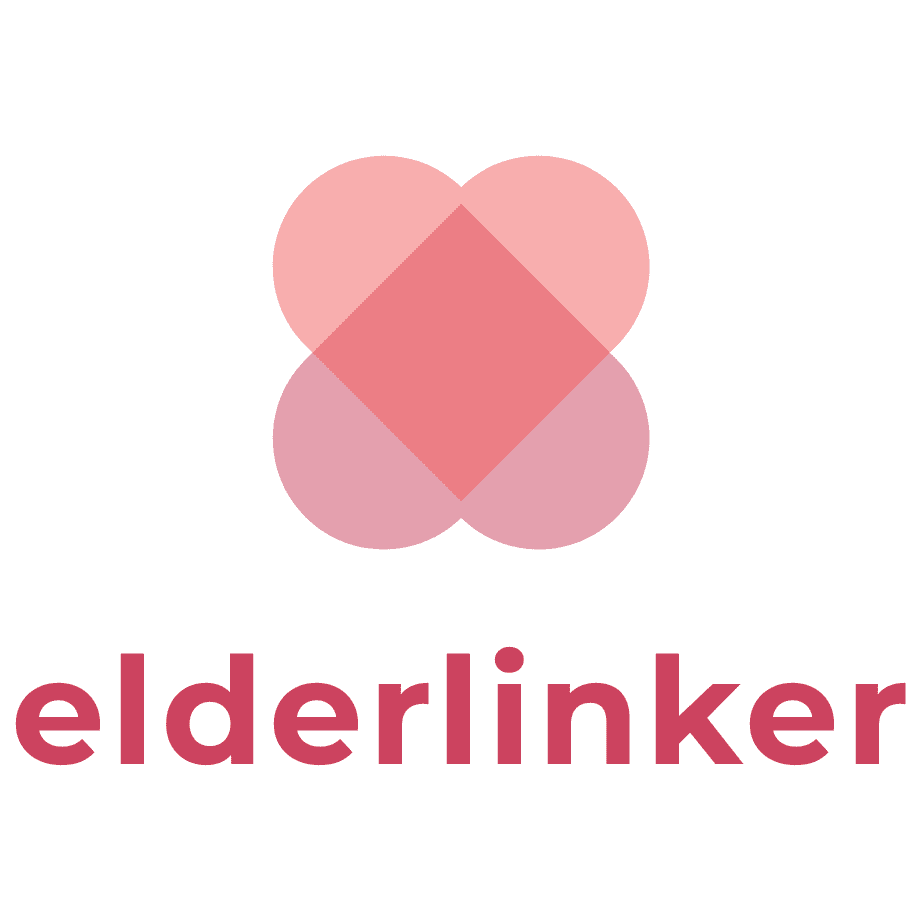

    

# 에더링커

멋쟁이 사자처럼 대학 11기 중앙 해커톤 참여 프로젝트입니다.  
<주제: 디지털 격차>  

<strong>에더링커</strong>는 노인들의 디지털 격차를 해소하기 위한 연결 통로입니다.  
스마트폰 사용법, 퀴즈를 통한 질병에 관한 정보 등을 습득할 수 있습니다.

 

## 주요 기능

 

## 사용 기술

  
 

 

## 참여 인원

| 김가희 | 신수민 | 김상아 |
| --- | --- | --- |
|  |  |  |
| [@soprue](https://github.com/soprue) | [@Shinmilli](https://github.com/Shinmilli) | [@saaaaaaaaaanga](https://github.com/saaaaaaaaaanga) |
| 메인 페이지 로그인 페이지 회원가입 페이지 질병 퀴즈 페이지 | 컴퓨터 교육 페이지 스마트폰 교육 페이지 | 소개 페이지 마이 페이지 |
